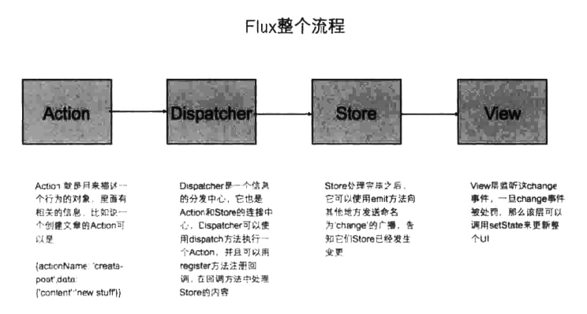
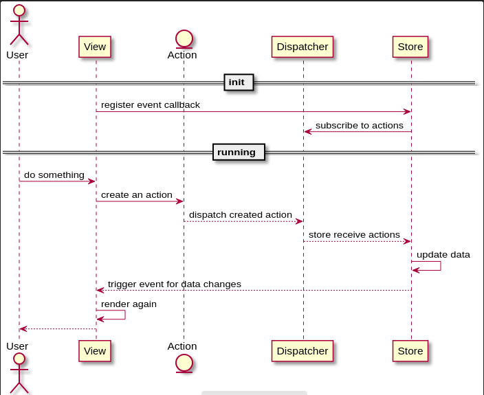

# webpack + react + babel

## 运行

本地调试:

```
$ npm run dev
```

## webpack

- loader
- plugin

通过loader将相关的资源进行转换, 最后集成到页面中.

## React

组件的表现形式:

- (**推荐**)stateless functonal component(无状态函数式组件), 用于当组件没有内部的state时
- 继承自React.Component的类

组件的设计尽量遵循**最小化state的准则**,
无状态组件唯一要关心的事情就是渲染数据, 而带state的组件用于处理各种事件逻辑.

### 组件的元素

- props, 用于保存**外部**组件**传入**的属性
- state, 组件**内部**的属性, 可以通过setState触发再次调用render, 来重新进行渲染
- refs, 用于获取DOM中通过**ref指定**的组件
- key, 每个组件有一个唯一的key值, 为了保证重新渲染的效率, 提供Diff算法的效率

### 组件的生命周期

- 组件初始化, 初始化过程只执行一次
  1. getDefaultProps
  2. getInitialState
  3. componentWillMount
  4. render
  5. componentDidMount
- 组件的props更新
  1. componentWillReceiveProps
  2. shouldComponentUpdate, 如果为true, 继续后面的流程
  3. componentWillUpdate
  4. render
  5. componentDidUpdate
- 组件卸载
  - componentWillUnmount

### Virtual DOM

React采用了Virtual DOM这个技术来提供渲染时的效率.

ReactElement是一种使用JavaScript描述的轻量级的, 无状态的, 不可改变的, DOM元素的虚拟表示,
而JSX就是一直一种构建ReactElement的便捷写法, 通过render将其插入到真正的DOM中.

当任何更新发生时, 这些变更就会发生在Virtual DOM上, 这些操作都是对JavaScript对象进行操作, 所以速度很快.

生成新的Virutal DOM后会使用**Diff算法来得到差异**, 然后将差异作用到真正的DOM元素上.
通过这种方法让DOM操作最小化, 来提高效率.

### Flux

Flux是Facebook提出的一套前端应用架构模式, 核心是**单向数据流**.





- Action, 由用户在View上触发的行为
- Dispatcher, 分发Action消息到相应的Store
- Store, 保存应用的数据. 处理订阅的Action, 更新相应的数据并通过event通知View更新. 单例模式, 即整个应用中每种store仅有一个 .
- View, 展示层

### Redux

Redux是JavaScript的**状态管理器**, 基于Flux, 提供了可预测的状态管理, 
可运行在不同的环境(客户端, 服务器以及原生应用).

三大定律:

- 单一数据源, 用store来存储整个state
- state是只读的, 不能直接修改state, 只能通过触发action来修改数据
- 使用纯函数(stateless functonal)来修改, 编写reducer来规定如何通过action来修改state

在Redux中, 整个程序的所有数据存储在唯一一个Object中.
reducer总是返回一个新的state, 而不会改变原有的state.
store保存reducer返回的新的state, 可以通过**store.getState**获取新的state
或者通过**store.subscribe**(listener)来监听state的变化.

可以在dispatch之后到调用reducer之前这个中间过程中插入middleware, 来提供一些扩展功能.

#### react-redux

- Provider
- connect

---
[Demo]: https://github.com/vikingmute/webpack-react-codes
[ECMAScript 6 入门]: http://es6.ruanyifeng.com/
[npm]: https://www.npmjs.com/
[webpack]: https://webpack.js.org/
[React]: https://zh-hans.reactjs.org/
[JavaScript DOM编程艺术]: https://book.douban.com/subject/6038371/
[Thinking in React]: https://reactjs.org/docs/thinking-in-react.html
[enzyme]: https://github.com/airbnb/enzyme